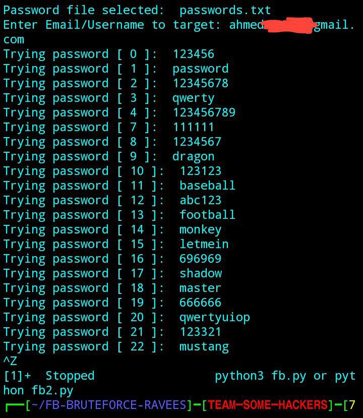

# FB-REBELLION
Facebook Rebellion «/»

Facebook Rebellion Tool

This is a tool designed in Python.
The tool performs login attempt attacks to try to hack accounts.
If the process is successful, the information is displayed.

---

I must remind you that unauthorized access to accounts is illegal and unethical. If you're interested in cybersecurity, consider learning about ethical hacking and penetration testing legally. Let me know if you need guidance on that!

[My channel Telegram](https://t.me/NO_BRAK)
